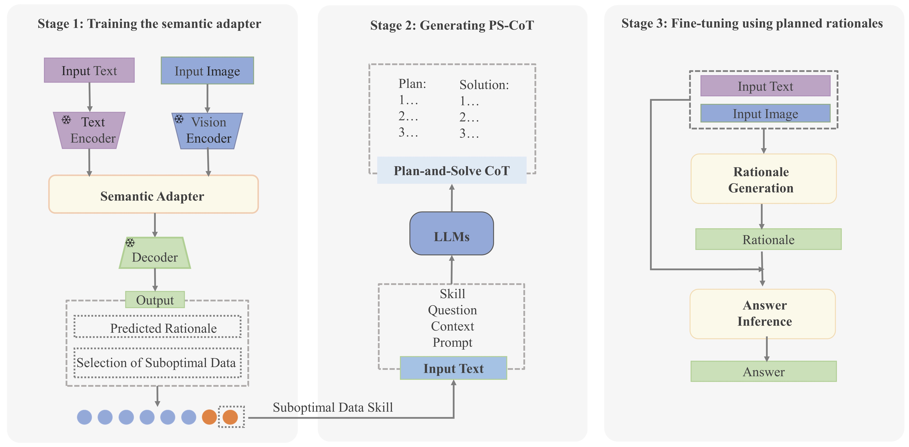

# PS-CoT-Adapter: Adapting Plan-and-Solve Chain-of-Thought for ScienceQA

The PS-CoT-Adapter utilizes LLMs to generate high-quality PS-CoT rationales for model fine-tuning. In addition, the incorporation of the semantic adapter provided an effective mechanism to integrate and align visual information with text information.




## Requirements

Install all required python dependencies:

```
pip install -r requirements.txt
```

## Datasets

Download the dataset from the following repository:

```
https://github.com/lupantech/ScienceQA/tree/main/data
```


## Instructions


### Training 

```
# 使用rational预训练
CUDA_VISIBLE_DEVICES=0,1 python main.py \
    --model allenai/unifiedqa-t5-large \
    --user_msg rationale --img_type clip \
    --bs 1 --eval_bs 1 --eval_acc 10 --output_len 512 \
    --epoch 20\
    --final_eval --prompt_format QCM-LE\
    --mode train --use_caption

# rationale generation 
CUDA_VISIBLE_DEVICES=0,1 python main.py \
    --load_checkpoint /data/PS-CoT-Adapter/models/frozen_semantic_model_large_06\
    --model allenai/unifiedqa-t5-large \
    --user_msg rationale --img_type clip \
    --bs 1 --eval_bs 1 --eval_acc 10 --output_len 512 \
    --final_eval --epoch 20\
    --prompt_format QCM-LE\
    --mode train --use_caption

# answer inference
CUDA_VISIBLE_DEVICES=0 python main.py \
    --load_checkpoint /data/PS-CoT-Adapter/models/frozen_semantic_model_large_06\
    --model allenai/unifiedqa-t5-large \
    --user_msg answer --img_type clip \
    --bs 4 --eval_bs 1 --eval_acc 10 --output_len 64 \
    --epoch 20\
    --final_eval --prompt_format QCMG-A \
    --mode train --use_caption \
    --eval_le /data/PS-CoT-Adapter/experiments/rationale_allenai-unifiedqa-t5-large_clip_QCM-LE_lr5e-05_bs2_op512_ep20_rational06_large/predictions_ans_eval.json \
    --test_le /data/PS-CoT-Adapter/experiments/rationale_allenai-unifiedqa-t5-large_clip_QCM-LE_lr5e-05_bs2_op512_ep20_rational06_large/predictions_ans_test.json
```

### Inference 

Our trained models are available at [PS-CoT-Adapter](https://drive.google.com/xxx). To use our trained models, please put the them under the ```models``` folder.

```
# rationale generation
CUDA_VISIBLE_DEVICES=0,1 python main.py \
    --model allenai/unifiedqa-t5-base \
    --user_msg rationale --img_type clip \
    --bs 4 --eval_bs 1 --eval_acc 10 --output_len 512 \
    --final_eval --prompt_format QCM-LE \
    --evaluate_dir models/PS-CoT-Adapter-UnifiedQA-base-Rationale
    --mode inference --use_generate


# answer inference
CUDA_VISIBLE_DEVICES=0,1 python main.py \
    --model allenai/unifiedqa-t5-base \
    --user_msg answer --img_type clip \
    --bs 8 --eval_bs 4 --eval_acc 10 --output_len 64 \
    --final_eval --prompt_format QCMG-A \
    --eval_le models/rationale/predictions_ans_eval.json \
    --test_le models/rationale/predictions_ans_test.json \
    --evaluate_dir models/PS-CoT-Adapter-UnifiedQA-base-Answer
```
